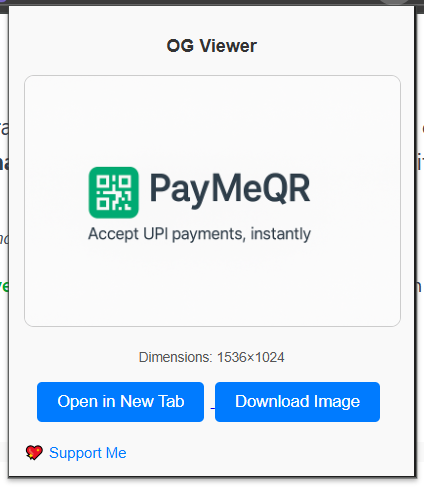

# OG Viewer

**OG Viewer** is a lightweight Chrome extension that lets you instantly preview and download the Open Graph (OG) image from any webpage.

---

## 🚀 Features

- 🔍 Automatically detects the OG image (`og:image`) from the current tab
- 🖼️ Displays the OG image in a clean popup
- 📐 Shows image dimensions (width × height)
- 📥 One-click download or open in a new tab

---

## 🧩 How to Install (Development Mode)

1. Clone or download this repository
2. Open Chrome and go to `chrome://extensions`
3. Enable **Developer Mode** (top right corner)
4. Click **Load unpacked** and select the extension folder
5. Visit any website, then click the OG Viewer icon in your toolbar

---

## 📄 License

MIT [License](./LICENSE)
